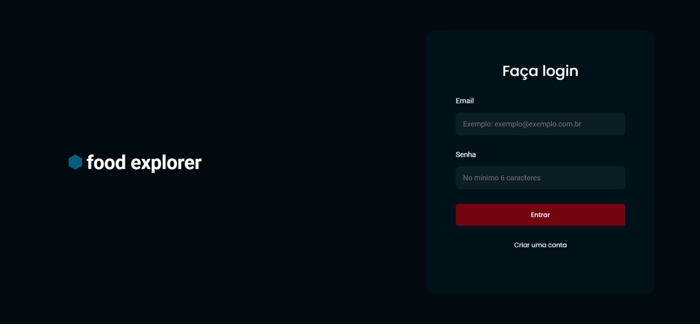
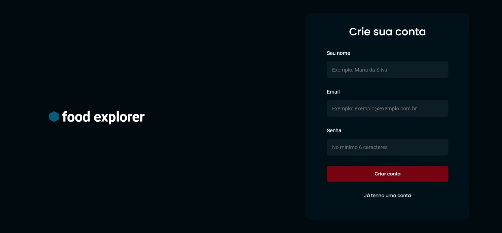
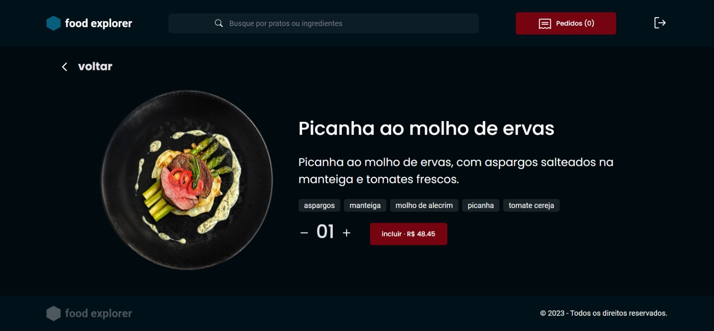
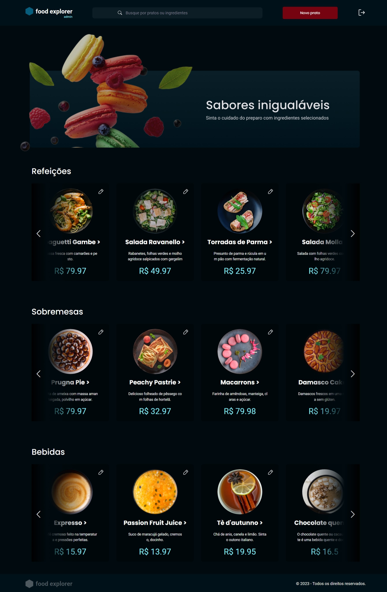
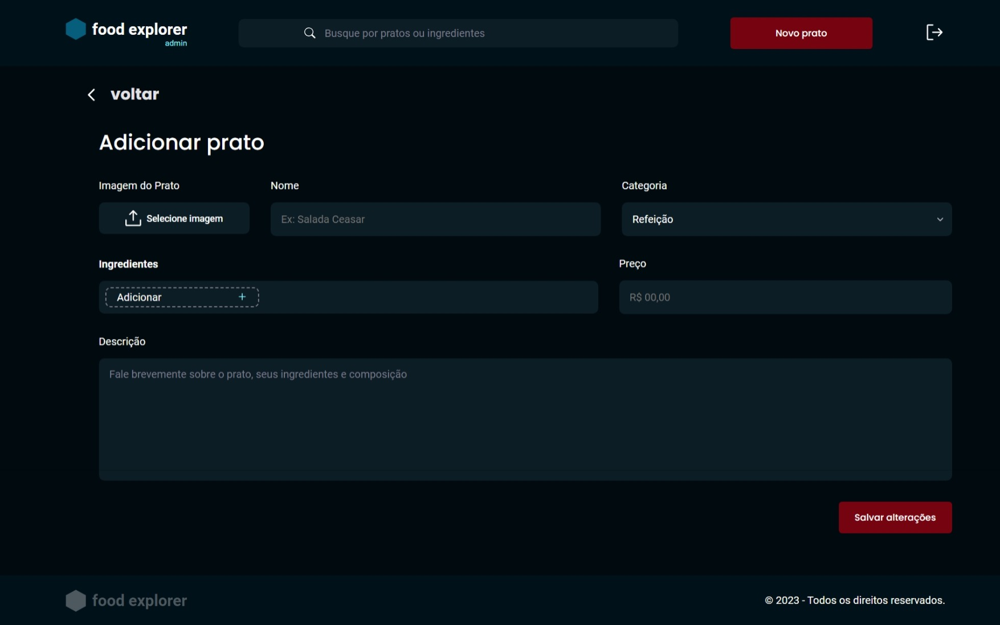
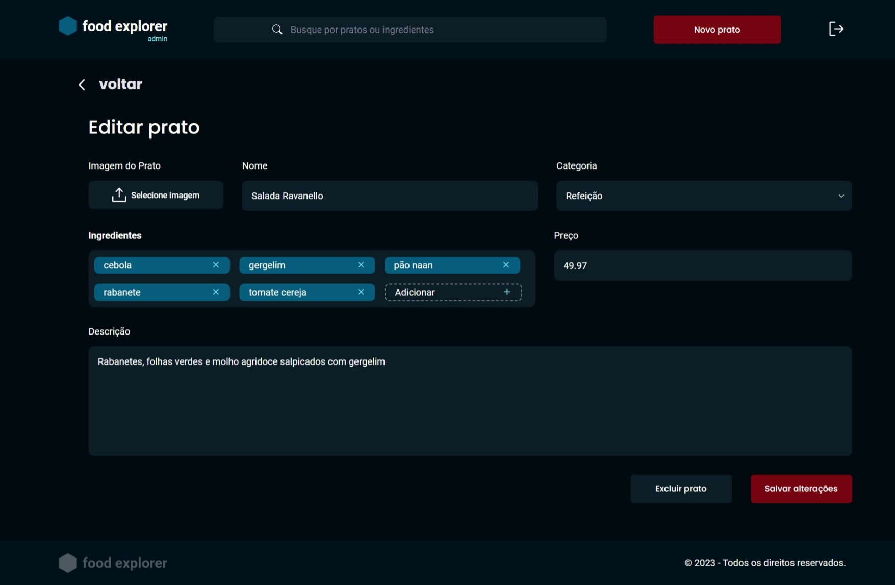

<h1 align="center">Food Explorer [Final Project]</h1>

O Food Explorer é um aplicativo que simula um menu interativo para um restaurante fictício. 
                  Ele possui duas personas: o admin e o usuário. O admin é responsável pela gestão do restaurante e tem a capacidade 
                  de criar, visualizar, editar e apagar pratos a qualquer momento. Cada prato contém informações como imagem, nome, 
                  categoria, descrição, ingredientes e preço. Após adicionar um prato, o admin recebe uma mensagem de sucesso e é 
                  redirecionado para a página principal. O usuário tem a capacidade de visualizar todos os pratos cadastrados e, ao 
                  clicar em um prato, é redirecionado para uma página com informações detalhadas sobre o prato. O objetivo é proporcionar 
                  uma experiência completa de visualização e interação com o cardápio do restaurante.

Acesse aqui ➡️➡️➡️ https://food-explorer-luana.netlify.app/

 

## 🗃️ Links dos Repositórios

#### ➡️ [Front-end](https://github.com/LuBernardino/food_explorer_frontend)

#### ➡️ [Back-end](https://github.com/LuBernardino/food_explorer_backend)

 

## Sign In - Sign Up:

## 💁🏽‍♀️ Acesso de usuário comum:

O usuário irá visualizar todos os pratos cadastrados e, quando clicar em um prato, será redirecionado para uma nova tela com informações mais detalhadas sobre ele.

Acesse com ➡️ Criar um cadastro de email

 

## 👩🏽‍💼 Acesso de usuário admin:

O admin é a pessoa responsável pelo restaurante, logo, poderá criar, visualizar, editar e apagar um prato a qualquer momento. Cada prato deve conter uma imagem, um nome, uma categoria, uma breve descrição, os ingredientes e o seu preço. Ao clicar em adicionar prato, o admin receberá uma mensagem de sucesso e será redirecionado para a página principal;

Acesse com ➡️ email: admin@admin.com senha: 123456

## 🚀 Tecnologias

Esse projeto foi desenvolvido com as seguintes tecnologias:

### Frontend
- `ReactJS` `Vite` `Axios` `swiper` `LocalStorage` `react-icons`
- `styled-components` `react-router-dom` `react-select` `react-input-mask`

### Backend
- `Node.js` `Express` `SQLite` `Knex.js` `JWT` `Middlewares`
- `Autenticação` `Upload de imagens` `API Restful` `Cors`
- `PM2` `Deploy e utilização do render` `Variáveis de ambiente`
- `Testes automatizados` `Jest`

## 🔖 Layout

Você pode visualizar o layout do projeto através [DESSE LINK](https://www.figma.com/file/tudj2tKleZpJGTd1valU78/food-explorer-v2-(Community)?type=design&node-id=5%3A980&t=uZO6pga2jsks6mxp-1). É necessário ter conta no [Figma](https://figma.com) para acessá-lo.

## :memo: Licença

Esse projeto está sob a licença [MIT](https://choosealicense.com/licenses/mit/).

---

Feito com ♥ by [@LuanaBernardino](https://www.linkedin.com/in/lubernardino/) :wave: 
